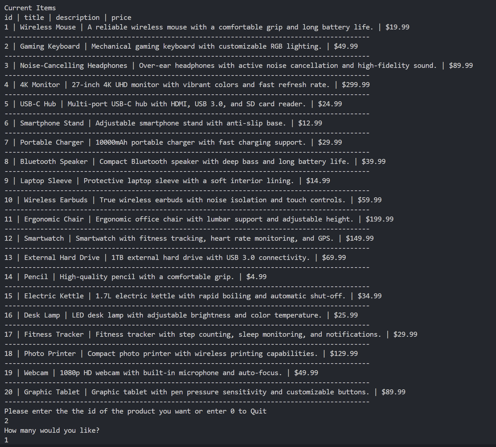
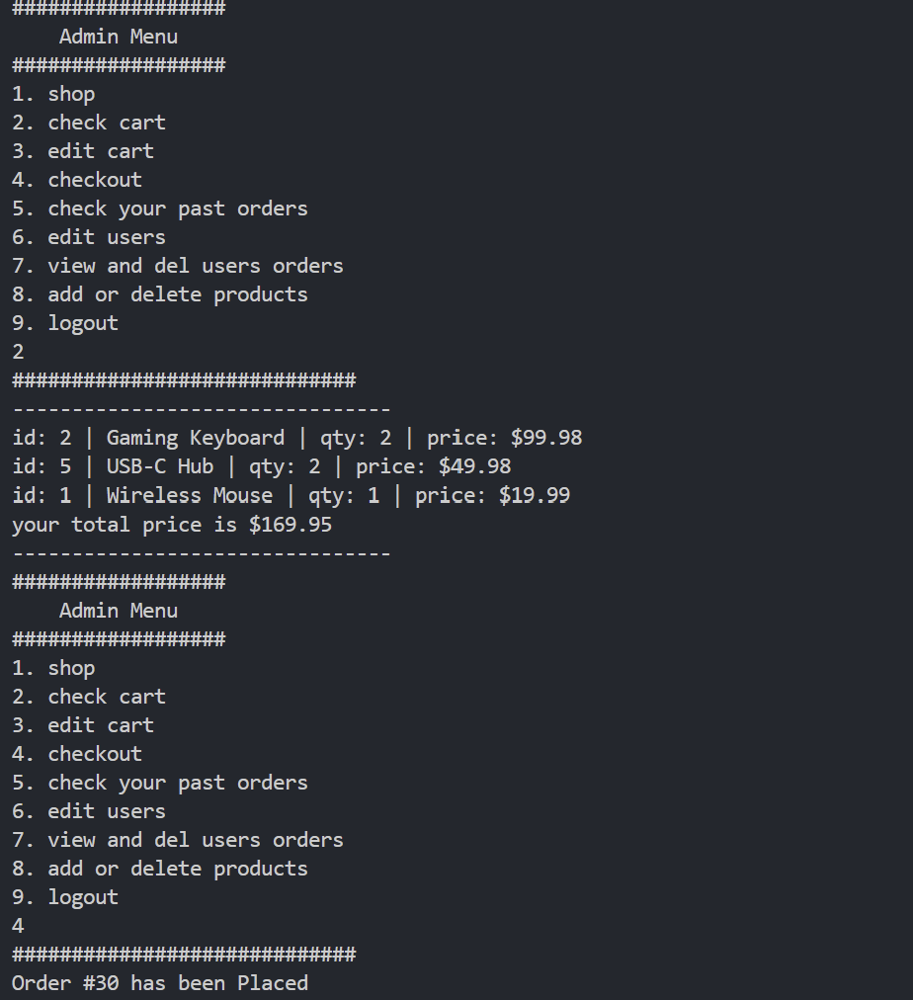

# 🛒 E-Commerce Python Project

This is a simple e-commerce management system built in Python. It supports managing accounts, products, and orders using a MySQL database. The application runs in the command line and provides a main menu for navigating features.

---

## Images

### Database Desgin 


### Admin Menu


### Store


### Checkout 


### Edit Store Products


## 📁 File Structure

```
.
├── Account.py        # Handles user account logic
├── main_menu.py      # Displays and controls the main menu
├── main.py           # Entry point for the application
├── mysql_logic.py    # MySQL database connection and queries
├── Order.py          # Handles order logic
├── Product.py        # Manages product information
└── README.md         # Project documentation
```

---

## 🔧 Setup Instructions

### 1. Install Requirements

Ensure Python 3 is installed. Then install the required MySQL connector:

```bash
pip install mysql-connector-python
```

### 2. MySQL Setup

Ensure you have a MySQL server running.

Create a database and required tables. Then, update your MySQL credentials in `mysql_logic.py`:

```python
connection = mysql.connector.connect(
    host="localhost",
    user="your_username",
    password="your_password",
    database="your_database"
)
```

---

## 🚀 How to Run

Run the project from the terminal:

```bash
python main.py
```

You'll see a menu that allows you to:

- Manage Accounts
- View/Add/Edit Products
- Place/View Orders
- Exit the application

---

## 📦 Module Breakdown

### `main.py`

- Entry point of the program.
- Runs the main menu loop.

### `main_menu.py`

- Displays interactive options for navigating features.
- Calls relevant modules based on user input.

### `Account.py`

- Handles user login and registration.
- Manages account-related actions.

### `Product.py`

- Add, update, and delete products.
- View product catalog.

### `Order.py`

- Manages order placement and history.
- Connects orders to products and accounts.

### `mysql_logic.py`

- Connects to the MySQL database.
- Executes SQL queries from other modules.

---

## ✅ Features

- Command-line interface
- Persistent data storage using MySQL
- Modular Python file structure
- User account management
- Product catalog CRUD operations
- Order processing and history

---

## 💡 Possible Improvements

- Role-based access (Admin/User)
- Input validation and error handling
- GUI implementation (Tkinter or PyQt)
- Unit testing and logging

---


